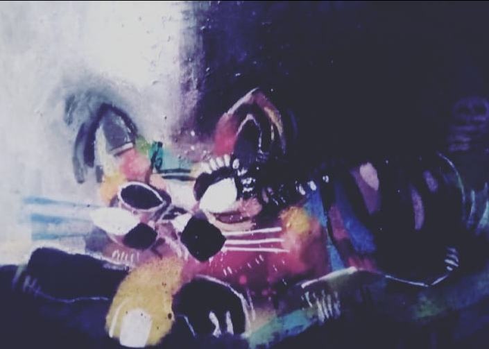

# Monsterzoid
**author: Jimmy, the mute.**

I was born without the ability to speak like other people. I was always teased in school. When I was a child, everyone excluded me. I got used to staying silent.

One day, my mother came home with a new toy. It was a mechanical cat. You pressed a little button and it moved and spoke. For a long time, it was my only friend. Its name was *Circuit*.

Then, on my sixth birthday, it disappeared. My mother said it was impossible for me to lose such a toy. I searched for it all day but didn't find it. Night came, and I was almost asleep, watching TV when someone knocked on the door. A boy, inside a huge robot, appeared holding Circuit in his arms.

The next day, I couldn't get that enormous robot out of my head. Circuit seemed so silly next to him that I ended up giving it to my younger brother and asked my mother to buy me a robot like the boy's. But my mother never had enough money to get me one.

A few years later, I went to find out about that enormous robot. To my surprise, it never existed.

* A drawing of Circuit made by me:

