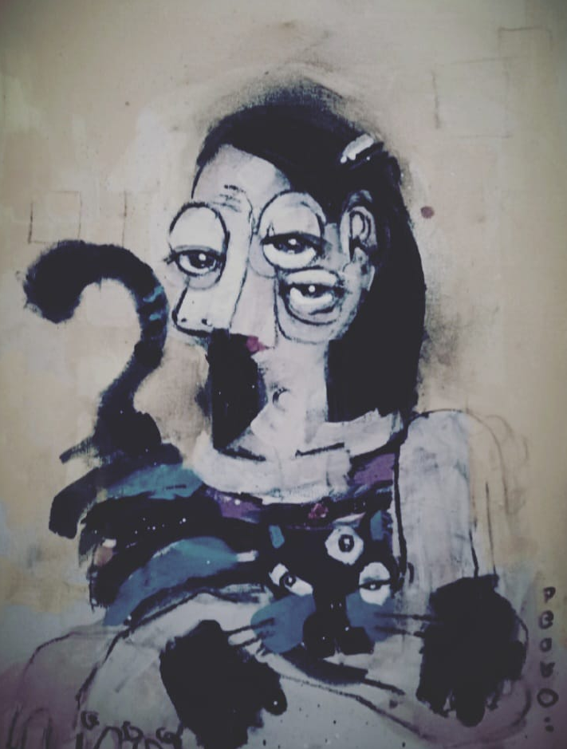

# The Purrplexity Show
**author: The Echo Kid**

When I was a kid, I loved watching a cartoon called "The Purrplexity Show." It was about a mischievous cat that always got into hilarious antics. At the end of each episode, they advertised a restaurant with a huge animatronic cat named Purrplexity.

I begged my parents to take me there all the time, and finally, on a sunny Saturday, they agreed. The restaurant was as surreal as the cartoon. Tables in strange shapes, waiters dressed as characters from the show, and a stage in the middle where animated performances took place.

Everything was going well until I needed to use the bathroom. I entered an empty hallway, and there it was, the Purrplexity animatronic. At first, it seemed harmless, blinking its eyes and moving its paws. But suddenly, its expression changed. It jumped off the stage, stared at me, and began to chase me.

A crazy chase ensued through the restaurant's corridors. It threw yarn balls and tried to catch me with mechanical claws. I, on the other hand, dodged and tried to make sense of what the heck was happening.

Finally, I reached the bathroom and closed the door behind me. Purrplexity banged on the door, scratching and growling in a robotic way. Believe it or not, he wanted to pull me into the toilet.

The next thing I knew, I woke up at home, on the living room couch. No one else in the restaurant mentioned seeing the animatronic. It was as if everything had been a bizarre dream.

* Purrplexity's portrait:
